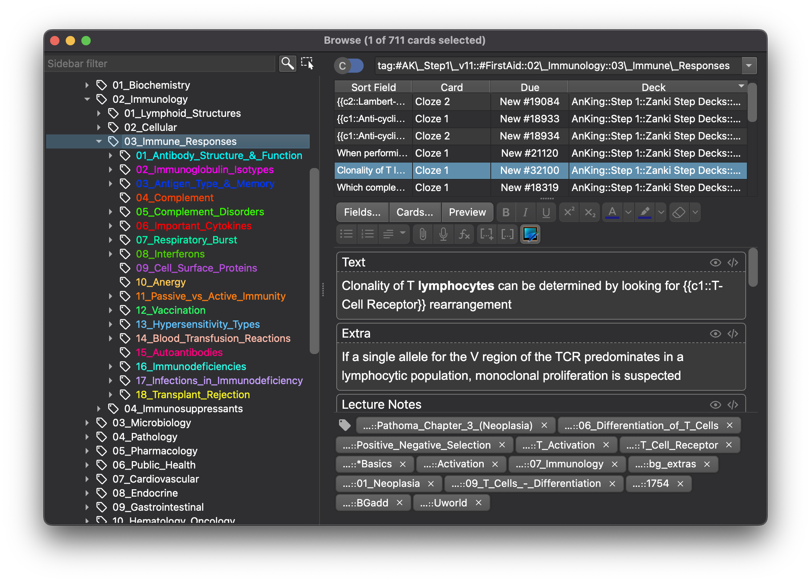

<!-- TODO: update screenshot -->

<h2 align="center">Colorful Tags for Anki</h2>

 

> Bring some color and structure to your Anki tags!

An add-on for the spaced-repetition flashcard app [Anki](https://apps.ankiweb.net/) that allows structuring your tags in hierarchies and modifying their appearance by coloring and pinning them.

Based on [Patrice Neff](https://patrice.ch/)'s original [Hierarchical Tags](https://ankiweb.net/shared/info/1089921461) and inspired by the coloring and pinning features first introduced with [BetterTags](https://www.patreon.com/posts/bettertags-v1-0-33338657).

### Table of Contents

<!-- MarkdownTOC -->

- [Table of Contents](#table-of-contents)
- [Installation](#installation)
- [Documentation](#documentation)
- [Building](#building)
- [Contributing](#contributing)
- [License and Credits](#license-and-credits)

<!-- /MarkdownTOC -->

### Installation

#### AnkiWeb <!-- omit in toc -->

The easiest way to install Colorful Tags is through [AnkiWeb](https://ankiweb.net/shared/info/594329229).

#### Manual installation <!-- omit in toc -->

Click here to see the instructions

1. Make sure you have the [latest version](https://apps.ankiweb.net/#download) of Anki 2.1 installed.
2. Download the latest `.ankiaddon` package from the [releases tab](https://github.com/glutanimate/popup-dictionary/releases) (you might need to click on *Assets* below the description to reveal the download links)
3. From Anki's main window, head to *Tools* → *Add-ons*
4. Drag-and-drop the `.ankiaddon` package onto the add-ons list
5. Restart Anki

### Documentation

For further information on the use of this add-on please check out [the description text](docs/description.md) for AnkiWeb.

### Building

With [Anki add-on builder](https://github.com/glutanimate/anki-addon-builder/) installed:

    git clone https://github.com/glutanimate/hierarchical-tags.git
    cd hierarchical-tags
    aab build

For more information on the build process please refer to [`aab`'s documentation](https://github.com/glutanimate/anki-addon-builder/#usage).

### Contributing

Contributions are welcome! Please review the [contribution guidelines](./CONTRIBUTING.md) on how to:

- Report issues
- File pull requests
- Support the project as a non-developer

### License and Credits

*Colorful Tags* is

*Copyright © 2014 [Patrice Neff](http://patrice.ch/)*

*Copyright © 2021 [RumovZ](https://github.com/RumovZ)*

*Copyright © 2018-2021 [Aristotelis P.](https://glutanimate.com/) (Glutanimate)*

A special thanks goes out to [AnKing](https://www.ankipalace.com/) for sponsoring parts of the development of this add-on.

Colorful Tags is free and open-source software. The add-on code that runs within Anki is released under the GNU AGPLv3 license. For more information please see the [LICENSE](https://github.com/glutanimate/hierarchical-tags/blob/master/LICENSE) file that accompanied this program.

This program is distributed in the hope that it will be useful, but WITHOUT ANY WARRANTY.
